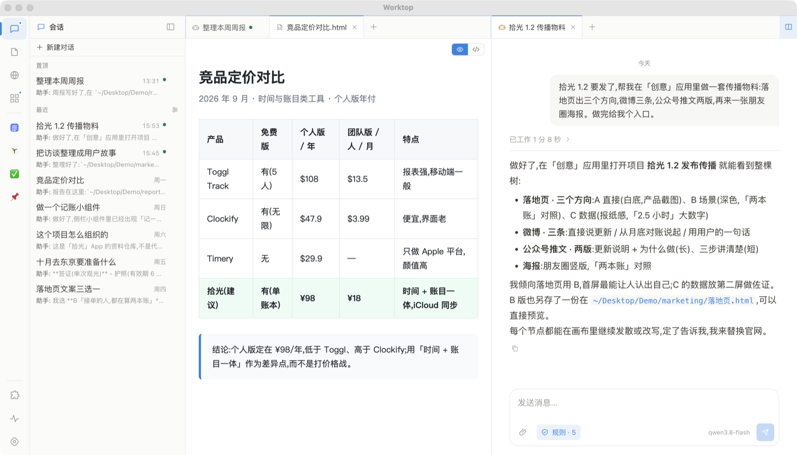
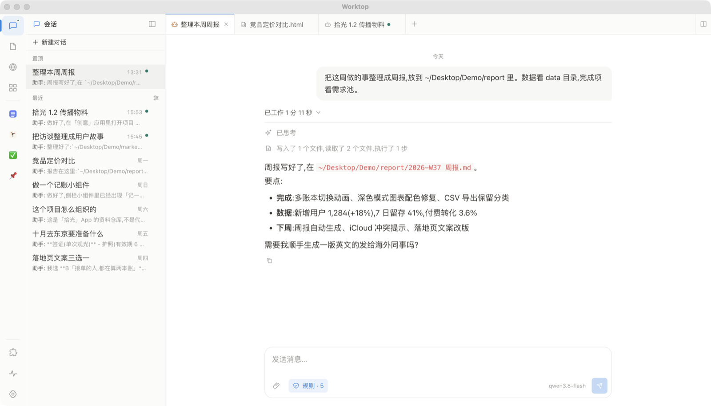
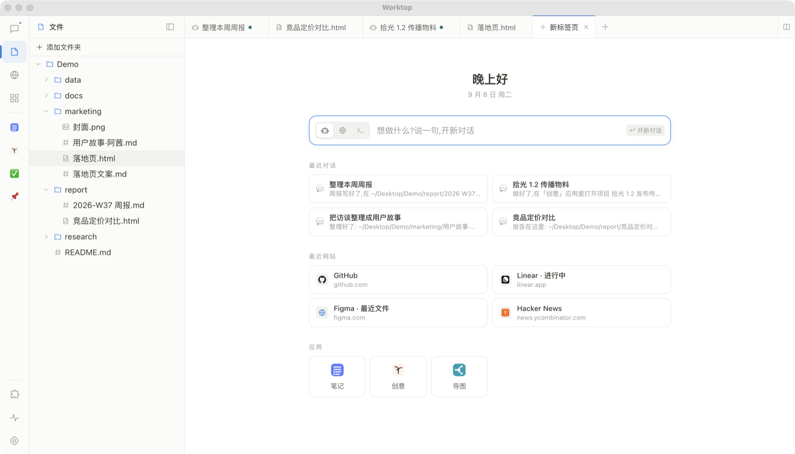
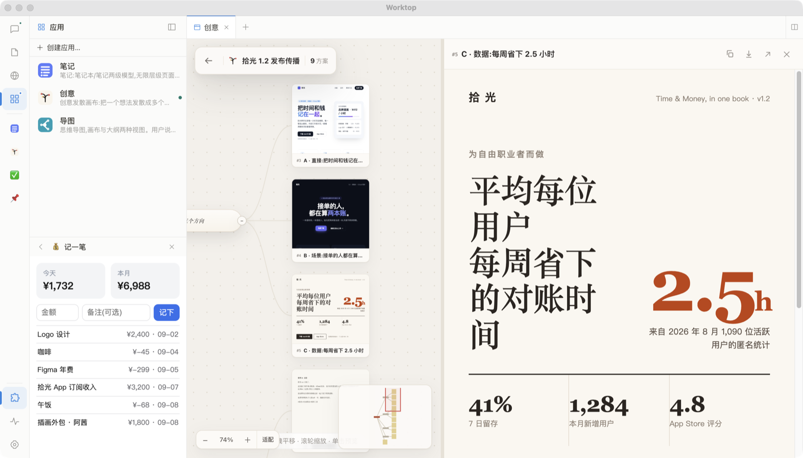
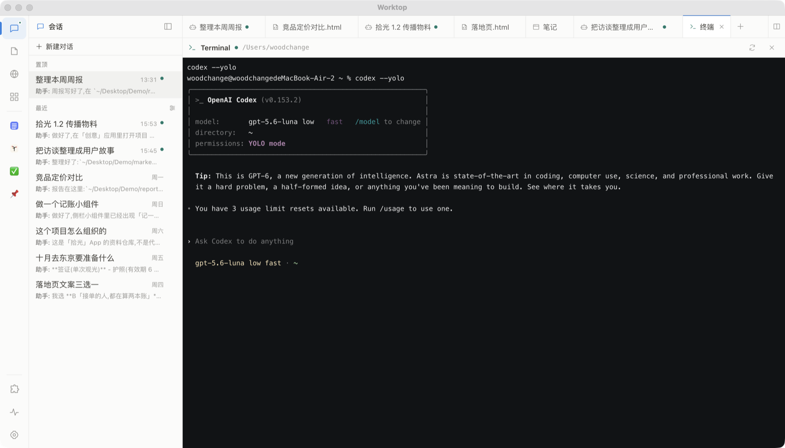

<div align="center">
  
  <h1>Worktop</h1>
  <p><strong>你的 AI，与你的电脑一起工作。</strong></p>
  <p>对话 · 文件 · 终端 · 浏览器 · 应用 · 小组件</p>
  <p>A personal AI desktop for everyday work.</p>
  <p>
    <a href="https://worktop.iimos.ai">官网下载</a> ·
    <a href="#开始使用">开始使用</a> ·
    <a href="#开发与构建">开发与构建</a> ·
    <a href="https://github.com/yanglongyun/Worktop/issues">反馈与建议</a> ·
    <a href="LICENSE">MIT License</a>
  </p>
</div>

---

Worktop 是一个个人 AI 工作台。你可以和 AI 讨论想法，也可以让它读写文件、执行命令、操作网页，或为自己制作一个应用和小组件。

对话、文件、终端、网页和应用在同一个窗口中打开，通过**标签页与左右分屏**并排查看。文件保存在你的电脑上，AI 生成的成果可以直接打开、编辑和继续使用。

<p align="center"></p>

## 在一个窗口里，完成一件事

| 能力 | 你可以做什么 |
| --- | --- |
| **与 AI 协作** | 流式对话，查看思考与工具执行过程；长对话自动压缩上下文，保留交接摘要 |
| **处理本地文件** | 浏览常用文件夹、编辑代码，预览 Markdown、HTML、图片和 PDF |
| **使用浏览器** | 打开收藏的网站，在保留登录态的内置浏览器中让 AI 阅读和操作页面 |
| **运行终端** | 使用交互式终端，让 AI 执行命令；通过 Git 面板查看仓库变化 |
| **扩展应用** | 安装本地应用，让 AI 通过应用提供的接口处理任务 |
| **制作小组件** | 把记账、打卡、数据查看等需求做成自己的侧栏工具 |

从一句话开始：

> “读一下这份项目代码，告诉我它是怎么组织的。”
>
> “把这些资料整理成一份能打开查看的 HTML 报告。”
>
> “给我做一个喝水打卡的小组件。”

## 界面一览

| | |
| --- | --- |
|  |  |
| 一句话交给它：读文件、跑命令、写文件 | 新标签页：对话 / 网址 / 命令三种模式 |
|  |  |
| 内置应用「创意」：一个想法发散成多个方向 | 终端就是终端，Codex / Claude Code 直接跑 |

## 从对话开始，自然使用电脑

**不用先选一个工作区。** 新建对话打开空白起始页，发送第一条消息时才创建对话记录。文件面板只是常用目录的入口，浏览哪个文件夹不会绑定对话。

**按任务找到文件。** 文件工具支持绝对路径与 `~/`；终端默认从用户主目录启动，执行命令时可以指定目录。你指定的保存位置优先，未指定的新文件可放在 `~/worktop/outputs/<对话ID>/`，需要写入时才创建目录。

**把能力交给 AI，把偏好留给自己。** 在设置中配置模型、助手指令、压缩提示词与操作规则。启用的技能按需读取，应用和小组件可以继续扩展工作台的能力。

> **运行边界**：Worktop 仍在开发中。命令与文件工具直接作用于本机，没有沙箱隔离；操作规则用于约束助手行为，不替代系统级隔离。模型请求发送到你配置的服务，请按任务需要选择模型与授权范围。

## 开始使用

**直接安装**:到 [worktop.iimos.ai](https://worktop.iimos.ai) 下载 macOS(Apple Silicon)或 Windows 安装包,装好后按下面第 1 步配置模型即可。macOS 版已签名公证;应用内置自动更新。

**从源码启动**:需要 Git、npm，以及支持内置 `node:sqlite` 的 Node.js，建议使用 Node.js 22.13 或更新版本。

```bash
git clone https://github.com/yanglongyun/Worktop.git
cd Worktop
npm install
npm run app
```

启动后：

1. 在左下角打开**设置 → 模型**，填写 API URL、API Key 和 Model。接口需要兼容 **Responses API**。
2. 查看**助手指令**和**规则**，按自己的使用习惯调整。
3. 点击**新建对话**，描述你想完成的事情；也可以添加文件作为上下文。

完整的内置浏览器操作依赖 Electron 桌面环境。前端开发页面用于调试界面，不能替代全部桌面能力。

## 开发与构建

开发时，在两个终端中分别启动后端与前端：

```bash
# 终端 1：后端，默认端口 9506
npm run dev

# 终端 2：前端，默认端口 5174
npm run ui
```

打开 <http://127.0.0.1:5174>。前端会将 API 和 WebSocket 请求代理到后端。

| 命令 | 用途 |
| --- | --- |
| `npm run app` | 构建前后端并启动 Electron |
| `npm run build` | 构建前端静态资源 |
| `npm run build:server` | 打包后端服务 |
| `npm run typecheck` | 检查 TypeScript 类型 |
| `npm run test:routes` | 验证主界面、应用与小组件接口 |
| `npm run app:mac` | 生成 macOS 应用目录 |
| `npm run dist:mac` | 构建 macOS 分发包 |
| `npm run app:win` | 生成 Windows 应用目录 |
| `npm run dist:win` | 构建 Windows 安装包 |

桌面打包请在对应系统上执行；构建脚本会复制当前 Node.js 运行时。macOS 分发配置包含签名设置，发布时需使用自己的签名与公证凭据。

<details>
<summary><strong>只运行本地 Web 服务</strong></summary>

```bash
npm run build
npm start
```

默认访问 <http://127.0.0.1:9506>。服务端端口可通过 `WORKTOP_PORT` 配置。

</details>

## 为自己扩展工作台

**应用**是带界面的本地网站，可以提供 HTTP API，让 AI 直接使用它的能力。宿主负责启动应用，并提供受权限约束的模型调用、任务与通知等接口。

**小组件**是侧栏里的轻量工具，使用 HTML、JavaScript 和 CSS，无需构建即可加载。每个组件拥有独立的本地来源，可以通过宿主接口使用 SQLite、模型和网络能力。

**技能**描述如何完成某类任务。AI 在需要时读取 `SKILL.md`，设置中的技能列表也可以直接打开说明文档。

制作小组件的完整约定见仓库内的 [widget 技能](resources/skills/widget/SKILL.md)。

<details>
<summary><strong>本地文件与数据目录</strong></summary>

用户文件保留在实际保存位置。SQLite 保存对话、消息、压缩记录、设置、收藏等结构化数据；应用和组件可以拥有自己的数据。

```text
~/.worktop/
├── apps/                  本地应用
│   └── .data/             应用数据
├── widgets/               侧栏小组件
└── skills/                技能说明

~/worktop/outputs/          未指定位置时的对话产物
```

macOS 桌面应用的宿主数据位于 `~/Library/Application Support/worktop/`。源码启动的服务默认使用 `~/Library/Application Support/Worktop Dev/`，可通过 `WORKTOP_HOME` 指定。

应用、组件和技能的根目录可通过 `WORKTOP_PRODUCT_HOME` 指定；默认仍为 `~/.worktop/`，不会随宿主数据目录自动切换。

</details>

<details>
<summary><strong>接口分工</strong></summary>

| 前缀 | 调用方 | 作用 |
| --- | --- | --- |
| `/api/*` | Worktop 主界面 | 管理对话、文件、浏览器、设置、应用与组件 |
| `/apps/*` | 应用 | 通过 `HOST_URL`、`APP_TOKEN` 与声明的权限访问宿主能力 |
| `/widgets/*` | 小组件 | 在组件自己的来源下访问同源宿主接口 |

主界面 API 按 `chats`、`files`、`browser`、`apps`、`widgets`、`skills`、`settings`、`system`、`git` 分组。WebSocket 为 `/api/ws`，健康检查为 `/health`。

应用自身的业务接口由应用定义，与宿主管理接口分开。

</details>

<details>
<summary><strong>源码结构</strong></summary>

```text
desktop/                   Electron 桌面壳与浏览器集成
ui/src/
├── api/                   按业务划分的请求与类型
└── components/            活动栏、侧栏、标签页、分屏与功能界面
server/
├── agent/                 模型与工具循环、上下文压缩、工具实现
├── ai/                    模型协议、请求、读流与重试
├── chats/                 对话、消息、轮次、提示词与确认
├── database/              SQLite 连接、表与索引
├── http/                  HTTP API、WebSocket 与静态资源
├── files/                 文件树、常用目录、附件与监听
├── browser/               浏览器宿主、收藏、历史与密码
├── apps/                  应用注册、进程、宿主能力与任务
├── widgets/               组件注册、站点与宿主能力
├── skills/                技能注册与文档解析
├── settings/              设置、默认提示词与规则
├── terminals/             交互式终端与后台命令
├── git/                   Git 操作
├── system/                运行路径与系统集成
└── shared/                前后端共用事件契约
resources/                 内置应用、技能等资源
```

Agent 循环接收组装好的模型输入和工具，不依赖对话存储。对话层负责持久化消息、恢复上下文和向界面广播事件；HTTP 层按业务调用对应模块。

</details>

## 技术栈

**Electron · React · TypeScript · Node.js · SQLite**

界面使用 Tailwind CSS 与 Vite，代码编辑使用 CodeMirror，终端使用 xterm.js 与 node-pty。SQLite 由 Node.js 内置模块提供，无需部署外部数据库服务。

## 参与与反馈

欢迎通过 [Issues](https://github.com/yanglongyun/Worktop/issues) 提交问题和建议。报告问题时，请附上系统版本、复现步骤和相关日志，并移除 API Key 等敏感信息。

提交代码前，请运行与改动相关的检查。涉及交互调整时，附上截图或简短操作说明，便于理解变化。

## License

[MIT](LICENSE) © 2026 realuckyang
